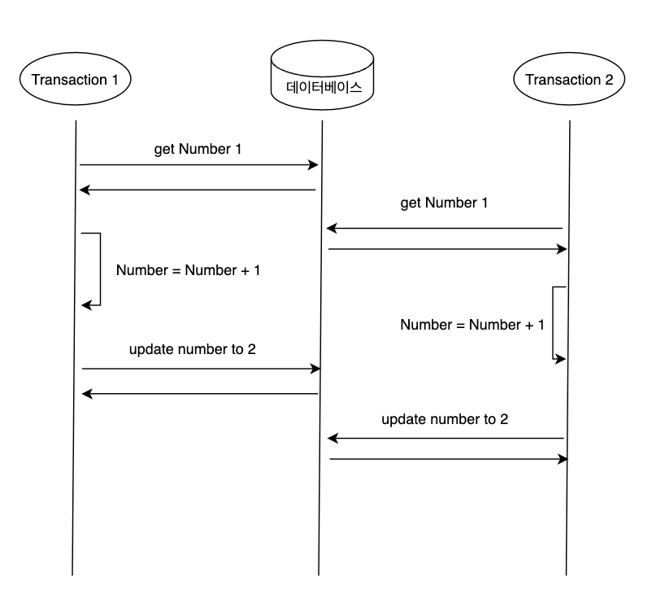
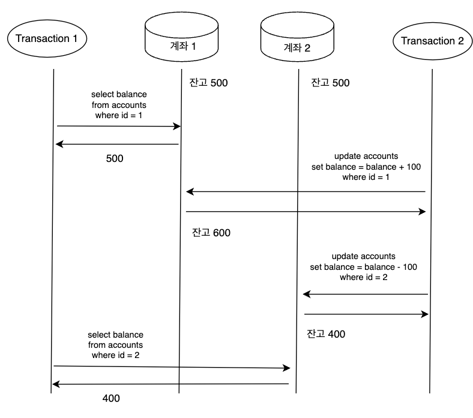

# Chapter 07. 트랜잭션
- - -

## ACID

### Atomicity (원자성)
* 다중 스레드 프로그래밍에서 한 스레드가 원자적 연산을 실행하면 다른 스레드에서는 절반만 완료된 연산은 관찰할 수 없다.
* 시스템은 연산을 실행하기 전이나 후의 상태만 존재할 수 있다.

### Consistency (일관성)
* 일관성이라는 단어는 여러 의미로 쓰인다.
  * 복제 일관성은 비동기식으로 복제되는 시스템에서 최종적 일관성을 유지하며, 복제 지연이 발생할 수 있다. 
  * 일관성 해싱은 시스템들에서 리밸런싱을 위해 사용하는 파티셔닝 방법이다.
  * CAP에서 일관성이라는 단어는 선형성을 의미한다.
  * ACID의 맥락에서의 일관성은 데이터베이스가 변경 사항에 대해 무결하게 적용되어야 한다는 개념이다.

### Isolation (격리성)
* 동시에 실행되는 트랜잭션에 대해서 격리되어야 하는 성질이다.
* 트랜잭션이 격리되지 않으면 한 테이블의 같은 로우에 대해 두 트랜잭션이 동시에 접근하여 데이터를 수정했을 때, 트랜잭션의 변경 사항이 유실될 수 있다.

* 격리 수준을 직렬화하면 이러한 문제를 방지할 수 있지만 성능상의 손해가 있기 떄문에 시스템 활동성이 저하될 수 있다.

### Durability (지속성)
* 트랜잭션이 성공했다면 데이터베이스에 영구히 보관되어야 한다.

### 단일 객체 쓰기
* 저장소 엔진들은 거의 보편적으로 한 노드에 존재하는 (키-값 쌍 같은) 단일 객체 수준에서 원자성과 격리성을 제공하는 것을 목표로 한다.
* 원자성은 장애 복구용 로그를 써서 구현할 수 있고, 격리성은 각 객체에 잠금을 사용해 동시에 한 스레드만 객체에 접근하도록 하여 구현할 수 있다.
* 단일 객체 연산은 여러 클라이언트가 동시에 같은 객체에 쓰려고 할 때 갱신 손실을 방지한다.

### 오류와 중단 처리
* 트랜잭션의 핵심은 오류가 생기면 중단되고 안전하게 재시도할 수 있다는 것이다.
  * 하지만 모든 시스템이 이 철학을 따르지는 않는다.
* 중단된 트랜잭션을 재시도하는 것은 완벽하지는 않다.
  * 트랜잭션이 실제로 성공했지만 서버가 클라이언트에게 커밋 성공을 알리는 도중 네트워크가 끊겼을 때, 클라이언트는 실패했다고 생각하여 재시도하면 트랜잭션이 두 번 실행될 수 있다.
  * 오류과 과부화 떄문이라면 트랜잭션의 재시도는 문제를 개선하는게 아니라 악화시킬 수 있다. 이런 문제는 재시도 횟수를 제한하든지 지수적 백오프를 사용하여 처리하는 방법이 있다.
  * 일시적인 오류(데드락, 격리성 위반, 일시적인 네트워크 단절, 장애 복구)만 재시도할 가치가 있으며 영구적인 오류는 재시도해도 소용이 없다.
  * 트랜잭션이 데이터베이스 외부에도 부수 효과가 있다면 트랜잭션이 중단될 때도 부수 효과가 실행될 수 있다.
  * 클라이언트 프로세스가 재시도 중에 죽어버리면 해당 데이터가 모두 손실된다.

### 완화된 격리 수준
* 동시성 버그는 타이밍에 운이 없을 때만 촉발되기 때문에 테스트로 발견하기 어렵다.
  * 직렬성 격리로 동시성 문제는 해결되지만 성능 비용이 크다.
  * 따라서 어떤 동시성 이슈로부터는 보호해주지만 모든 이슈로부터 보호해주지는 않는, 완화된 격리 수준을 사용하는 시스템이 흔하다.

### Read Committed
* 가장 기본적인 수준의 트랜잭션 격리 수준으로 아래의 두 가지를 보장한다.
  * 데이터베이스에서 읽을 때 커밋된 데이터만 보게 된다. (더티 리드 방지)
  * 데이터베이스에 쓸 때 커밋된 데이터만 덮어쓰게 된다. (더티 쓰기 방지)
* 더티 리드 방지
  * 트랜잭션이 쓴 내용은 커밋된 후에야 다른 트랜잭션에서 관찰될 수 있다.
  * 트랜잭션이 여러 객체를 갱신하는데 더티 읽기가 생기면 다른 트랜잭션이 일부는 갱신된 값을, 일부는 갱신되지 않은 값을 볼 수 있다.
  * 트랜잭션이 중단되면 그때까지 쓴 내용은 모두 롤백돼야 한다. 만약 더티 리드를 허용하면 트랜잭션이 나중에 롤백될 데이터를 볼 수 있게 된다.
* 더티 쓰기 방지
  * 아직 커밋되지 않은 트랜잭션에서 쓴 작업을 나중에 실행된 쓰기 작업이 커밋되지 않은 값을 덮어써버리게 되는 현상을 더티 쓰기라고 한다.
  * 보통 먼저 쓴 트랜잭션이 커밋되거나 중단될 때까지 두 번째 쓰기를 지연시키는 방법을 사용한다.
* 하지만 Read Committed는 레이스 컨디션에서 발생하는 갱신 손질을 막지 못한다.

### 스냅숏 격리와 반복 읽기
* Read Committed 격리 수준은 아래와 같이 동시성 문제가 발생할 수 있다.

* Transaction 1 은 현재 계좌 1, 2의 잔고 합이 900원인 것처럼 보이지만 실제로는 1000원 그대로이다.
* 이러한 현상을 unrepeatable read나 read skew라고 한다.
* 스냅숏 격리는 각 트랜잭션이 데이트베이스의 일관된 스냅숏으로으로부터 읽는다.
  * 즉 트랜잭션이 시작할 때 데이터베이스에 커밋된 상태였던 모든 데이터를 본다.
  * 데이터가 나중에 다른 트랜잭션에 의해 바뀌더라도 각 트랜잭션은 특정한 시점의 과거 데이터를 볼 뿐이다.
  * 스냅숏 격리는 백업이나 분석처럼 실행하는 데 오래 걸리며 읽기만 실행하는 질의에 유용하다. (질의가 실행 중일 때 동시에 대상 데이터가 변경되면 해당 질의의 의미에 대해 추론하기가 매우 어려움)
