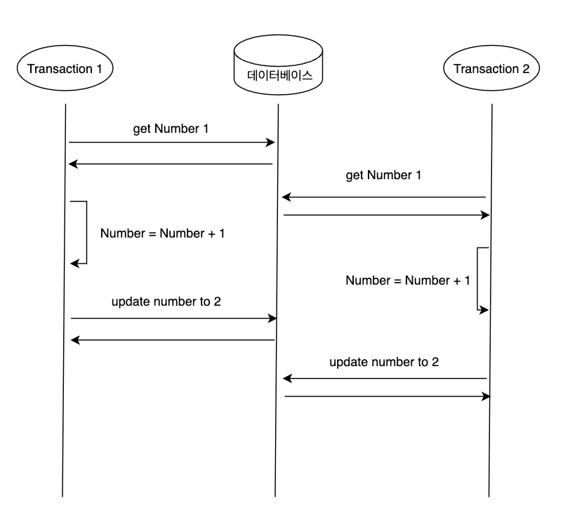
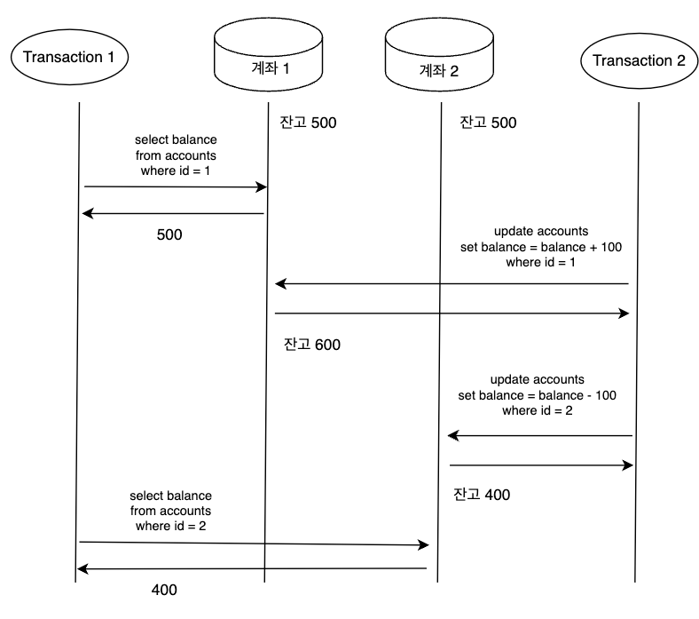
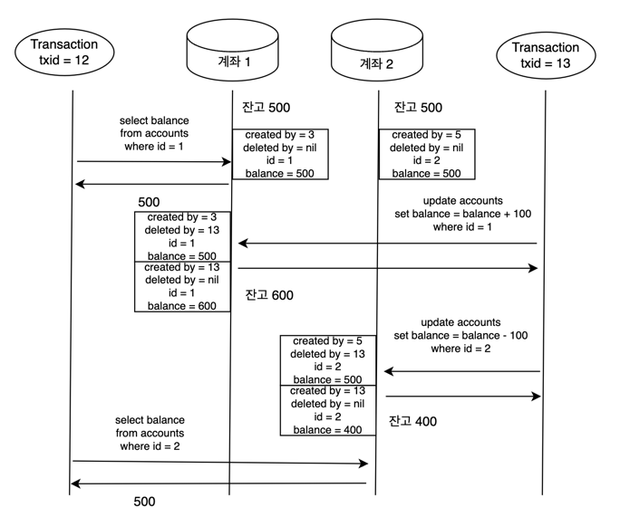
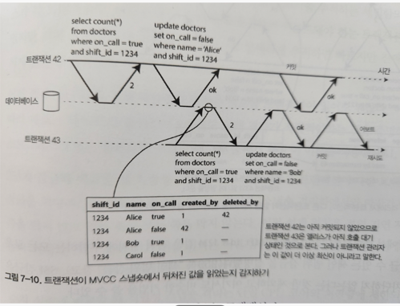
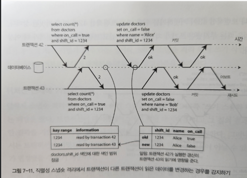

# Chapter 07. 트랜잭션
- - -

## ACID

### Atomicity (원자성)
* 다중 스레드 프로그래밍에서 한 스레드가 원자적 연산을 실행하면 다른 스레드에서는 절반만 완료된 연산은 관찰할 수 없다.
* 시스템은 연산을 실행하기 전이나 후의 상태만 존재할 수 있다.

### Consistency (일관성)
* 일관성이라는 단어는 여러 의미로 쓰인다.
  * 복제 일관성은 비동기식으로 복제되는 시스템에서 최종적 일관성을 유지하며, 복제 지연이 발생할 수 있다. 
  * 일관성 해싱은 시스템들에서 리밸런싱을 위해 사용하는 파티셔닝 방법이다.
  * CAP에서 일관성이라는 단어는 선형성을 의미한다.
  * ACID의 맥락에서의 일관성은 데이터베이스가 변경 사항에 대해 무결하게 적용되어야 한다는 개념이다.

### Isolation (격리성)
* 동시에 실행되는 트랜잭션에 대해서 격리되어야 하는 성질이다.
* 트랜잭션이 격리되지 않으면 한 테이블의 같은 로우에 대해 두 트랜잭션이 동시에 접근하여 데이터를 수정했을 때, 트랜잭션의 변경 사항이 유실될 수 있다.

* 격리 수준을 직렬화하면 이러한 문제를 방지할 수 있지만 성능상의 손해가 있기 떄문에 시스템 활동성이 저하될 수 있다.

### Durability (지속성)
* 트랜잭션이 성공했다면 데이터베이스에 영구히 보관되어야 한다.

### 단일 객체 쓰기
* 저장소 엔진들은 거의 보편적으로 한 노드에 존재하는 (키-값 쌍 같은) 단일 객체 수준에서 원자성과 격리성을 제공하는 것을 목표로 한다.
* 원자성은 장애 복구용 로그를 써서 구현할 수 있고, 격리성은 각 객체에 잠금을 사용해 동시에 한 스레드만 객체에 접근하도록 하여 구현할 수 있다.
* 단일 객체 연산은 여러 클라이언트가 동시에 같은 객체에 쓰려고 할 때 갱신 손실을 방지한다.

### 오류와 중단 처리
* 트랜잭션의 핵심은 오류가 생기면 중단되고 안전하게 재시도할 수 있다는 것이다.
  * 하지만 모든 시스템이 이 철학을 따르지는 않는다.
* 중단된 트랜잭션을 재시도하는 것은 완벽하지는 않다.
  * 트랜잭션이 실제로 성공했지만 서버가 클라이언트에게 커밋 성공을 알리는 도중 네트워크가 끊겼을 때, 클라이언트는 실패했다고 생각하여 재시도하면 트랜잭션이 두 번 실행될 수 있다.
  * 오류과 과부화 떄문이라면 트랜잭션의 재시도는 문제를 개선하는게 아니라 악화시킬 수 있다. 이런 문제는 재시도 횟수를 제한하든지 지수적 백오프를 사용하여 처리하는 방법이 있다.
  * 일시적인 오류(데드락, 격리성 위반, 일시적인 네트워크 단절, 장애 복구)만 재시도할 가치가 있으며 영구적인 오류는 재시도해도 소용이 없다.
  * 트랜잭션이 데이터베이스 외부에도 부수 효과가 있다면 트랜잭션이 중단될 때도 부수 효과가 실행될 수 있다.
  * 클라이언트 프로세스가 재시도 중에 죽어버리면 해당 데이터가 모두 손실된다.

### 완화된 격리 수준
* 동시성 버그는 타이밍에 운이 없을 때만 촉발되기 때문에 테스트로 발견하기 어렵다.
  * 직렬성 격리로 동시성 문제는 해결되지만 성능 비용이 크다.
  * 따라서 어떤 동시성 이슈로부터는 보호해주지만 모든 이슈로부터 보호해주지는 않는, 완화된 격리 수준을 사용하는 시스템이 흔하다.

### Read Committed
* 가장 기본적인 수준의 트랜잭션 격리 수준으로 아래의 두 가지를 보장한다.
  * 데이터베이스에서 읽을 때 커밋된 데이터만 보게 된다. (더티 리드 방지)
  * 데이터베이스에 쓸 때 커밋된 데이터만 덮어쓰게 된다. (더티 쓰기 방지)
* 더티 리드 방지
  * 트랜잭션이 쓴 내용은 커밋된 후에야 다른 트랜잭션에서 관찰될 수 있다.
  * 트랜잭션이 여러 객체를 갱신하는데 더티 읽기가 생기면 다른 트랜잭션이 일부는 갱신된 값을, 일부는 갱신되지 않은 값을 볼 수 있다.
  * 트랜잭션이 중단되면 그때까지 쓴 내용은 모두 롤백돼야 한다. 만약 더티 리드를 허용하면 트랜잭션이 나중에 롤백될 데이터를 볼 수 있게 된다.
* 더티 쓰기 방지
  * 아직 커밋되지 않은 트랜잭션에서 쓴 작업을 나중에 실행된 쓰기 작업이 커밋되지 않은 값을 덮어써버리게 되는 현상을 더티 쓰기라고 한다.
  * 보통 먼저 쓴 트랜잭션이 커밋되거나 중단될 때까지 두 번째 쓰기를 지연시키는 방법을 사용한다.
* 하지만 Read Committed는 레이스 컨디션에서 발생하는 갱신 손질을 막지 못한다.

### 스냅숏 격리와 반복 읽기
* Read Committed 격리 수준은 아래와 같이 동시성 문제가 발생할 수 있다.

* Transaction 1 은 현재 계좌 1, 2의 잔고 합이 900원인 것처럼 보이지만 실제로는 1000원 그대로이다.
* 이러한 현상을 unrepeatable read나 read skew라고 한다.
* 스냅숏 격리는 각 트랜잭션이 데이트베이스의 일관된 스냅숏으로으로부터 읽는다.
  * 즉 트랜잭션이 시작할 때 데이터베이스에 커밋된 상태였던 모든 데이터를 본다.
  * 데이터가 나중에 다른 트랜잭션에 의해 바뀌더라도 각 트랜잭션은 특정한 시점의 과거 데이터를 볼 뿐이다.
  * 스냅숏 격리는 백업이나 분석처럼 실행하는 데 오래 걸리며 읽기만 실행하는 질의에 유용하다. (질의가 실행 중일 때 동시에 대상 데이터가 변경되면 해당 질의의 의미에 대해 추론하기가 매우 어려움)

### 스냅숏 격리 구현
* 성능 관점에서 스냅숏 격리의 핵심은 읽는 쪽에서 쓰는 쪽을 결코 차단하지 않고 쓰는 쪽에서 읽는 쪽을 결코 차단하지 않는다는 것이다.
  * 데이터베이스는 잠금 경쟁 없이 쓰기 작업이 일상적으로 처리되는 것과 동시에 일관성 있는 스냅숏에 대해 오래 실행되는 읽기 작업을 처리할 수 있다.
* 스냅숏 격리를 구현하는 방법으로 MVCC 기법을 사용한다. (Multi-version concurrency control)
* MVCC의 트랜잭션 처리 방법
  * 트랜잭션이 시작하면 계속 증가하는 고유한 트랜잭션 ID(txid)를 할당받는다.
  * 트랜잭션이 데이터베이스에 데이터를 쓸 때마다 쓰기를 실행한 트랜잭션의 ID가 함께 붙는다.
  * 테이블의 각 로우에는 그 로우를 테이블에 삽입한 트랜잭션 ID를 갖는 created_by 필드가 있고, 각 로우에는 처음에는 비어있는 deleted_by 필드가 있다.
  * 트랜잭션이 로우를 삭제하면 실제로 데이터베이스에서 지우지 않고 deleted_by 필드를 삭제 요청 트랜잭션의 ID로 설정하여 논리적으로 표시한다.
  * 나중에 아무 트랜잭션도 더 이상 삭제된 데이터에 접근하지 않는 게 확실해지면 데이터베이스의 가비지 컬렉션 프로세스가 지워졌다고 표시된 로우들을 삭제하여 사용량을 줄인다.
  * 갱신은 내부에서 삭제와 생성으로 변환한다.

* 위의 플로우에서 txid=12인 트랜잭션은 계좌2의 잔액을 읽어 갈 때, 자신의 txid보다 작은 스냅숏에 대해서만 읽기를 수행한다.
  * 이렇게 함으로써 txid=13인 트랜잭션이 update하여 새로운 스냅숏을 쓰더라도 txid=12 트랜잭션은 잔액이 500원인 스냅숏을 일관성 있게 읽어갈 수 있게 된다.

### 일관된 스냅숏을 보는 가시성 규칙
1. 데이터베이스는 각 트랜잭션을 시작할 때 그 시점에 진행중인(아직 커밋이나 중단되지 않은) 모든 트랜잭션의 목록을 만든다. 이 트랜잭션들이 쓴 데이터는 모두 무시된다. (데이터를 쓴 트랜잭션이 나중에 커밋되더라도 마찬가지)
2. 중단된 트랜잭션이 쓴 데이터는 모두 무시된다.
3. 트랜잭션 ID가 더 큰 트랜잭션이 쓴 데이터는 그 트랜잭션의 커밋 여부에 관계 없이 모두 무시된다.
4. 그 밖의 모든 데이터는 애플리케이션의 질의로 볼 수 있다.

* 데이터베이스는 갱신할 때 값을 교체하지 않고 값이 바뀔 때마다 새 버전을 생성함으로써 작은 오버헤드만 유발하면서 일관된 시냅숏을 제공할 수 있다.

### 색인과 스냅숏 격리
* 다중 버전 데이터베이스에서 색인이 동작하는 하나의 선택지는 단순하게 색인이 객체의 모든 버전을 가리키게 하고 색인 질의가 현재 트랜잭션에서 볼 수 없는 버전을 걸러내게 하는 것이다.
* B 트리의 변종으로, 추가 전용이며 쓸 때 복사(append-only/copy-on-write)되는 색인 방법은 쓰기를 실행하는 모든 트랜잭션은 새로운 B 트리 루트를 생성한다.
  * 특정 루트는 그것이 생성되는 시점에 해당하는 데이터베이스의 일관된 스냅숏이 된다.
  * 나중에 실행되는 쓰기는 새로운 트리 루트만 생성할 수 있고 존재하는 B 트리를 변경할 수 없으므로 트랜잭션 ID를 기반으로 객체를 걸러낼 필요가 없다.
  * 하지만 컴팩션과 가비지 컬랙션을 실행하는 백그라운드 프로세스가 필요하다.

### 갱신 손실 방지
* 갱신 손실 문제는 두 트랜잭션이 작업을 동시에 하면 두 번째 쓰기 작업이 첫 번째 작업 변경을 포함하지 않으므로 변경 중 하나는 손실될 수 있다.
* 갱신 손실 문제는 애플리케이션에서 값을 읽고 변경한 후에 변경된 값을 다시 쓸 때 발생할 수 있다. (read-modify-write 주기)

### 원자적 쓰기 연산
* 데이터베이스에서 원자적 갱신 연산을 제공하면 read-modify-write 주기를 구현할 필요를 없애준다.
* 예를 들어 다음 명령은 대부분의 관계형 데이터베이스에서 동시성 안전(concurrency-safe)하다.
> UPDATE counters SET value = value + 1 WHERE key = 'foo';
* 원자적 연산은 보통 객체를 읽을 때 그 객체에 exclusive lock을 획득하여 갱신이 적용될 때까지 다른 트랜잭션에서 그 객체를 읽지 못하게 한다.
* 다른 선택지는 모든 원자적 연산을 단일 스레드에서 실행되도록 강제하는 것이다. (성능에 좋지 않을 것 같다.)

### 명시적 잠금
```sql
BEGIN TRANSACTION;
SELECT *
FROM figures
WHERE name = 'robot' AND game_id = 222
FOR UPDATE;

UPDATE figures SET position = 'c4' WHERE id = 1234;
```
* FOR UPDATE 절은 데이터베이스가 이 질의에 의해 반환된 모둔 로우에 잠금을 획득하도록 한다.
* 하지만 레이드 컨디션을 유발할 가능성이 크므로 주의해야 한다.

### Compare-and-set
* Compare and set은 값을 마지막으로 읽은 후로 변경되지 않았을 때만 갱신을 허용함으로써 갱신 손실을 회피하는 것이다.
  * ex) java의 concurrent hashmap, atomic integer가 있다.
* 단, 데이터베이스가 WHERE 절이 오래된 스냅숏으로부터 읽는 것을 허용한다면 갱신 손실을 막지 못할 수 있다.

### 충돌 해소와 복제
* 다중 리더 또는 리더 없는 복제를 사용하는 데이터베이스는 쓰기가 동시에 실행되고 비동기식으로 복제되는 것을 허용하므로 데이터의 최신 복자본이 하나만 있으리라고 보장할 수 없다.
* 쓰기가 동시에 실행될 때 한 값에 대해서 여러 개의 충돌된 버전을 생성하는 것을 허용하고 사후에 애플리케이션 코드나 특별한 데이터 구조를 사용해 충돌을 해소하고 이 버전들을 병합하는 방법이 있다.
* 반면 최종 쓰기 승리(last write wins, LWW) 충돌 해소 방법은 갱신 손실이 발생하기 쉽다. (많은 복제 데이터베이스는 LWW가 기본 설정이다.)

### 쓰기 스큐

* 위 그림은 on call 사람이 최소 1명 이상이 있어야 한다고 존재할 때, 쓰기 스큐에 의해 발생하는 문제이다.
* 쓰키 스큐는 두 트랜잭션이 같은 객체들을 읽어서 그중 일부를 갱신할 때 나타날 수 있다.
  * 다른 트랜잭션이 다른 객체를 갱신했으므로 더티 쓰기도 아니고 갱신 손실도 아니다.
* 직렬성 격리 수준을 사용할 수 없다면 트랜잭션이 의존하는 로우를 명시적으로 잠그는 것이 차선책이다. (FOR UPDATE)

### 쓰기 스큐를 유발하는 팬텀
1. SELECT 질의가 어떤 검색 조건에 부합하는 로우를 검색함으로써 어떤 요구사항을 만족하는지 확인한다.
2. 첫 번째 질의의 결과에 따라 애플리케이션 코드는 어떻게 진행할지 결정(해당 연산을 계속 처리할지 오류를 보고하고 중단할지)한다.
3. 애플리케이션이 계속 처리하기로 결정했다면 데이터베이스에 쓰고(INSERT, UPDATE, DELETE) 트랜잭션을 커밋한다. 이 쓰기를 효과로 인해 1단계의 SELECT 질의를 재실행하면 다른 결과를 얻게 된다.
* 위 과정은 다른 순서로 일어날 수도 있다. (쓰기 먼저 실행하고 SELECT 질의를 실행하는 경우)
* 어떤 검색 조건에 부합하는 로우가 존재하지 않는지 확인하고 쓰기 작업이 같은 조건에 부합하는 로우를 추가하는 경우에 1단계의 질의가 아무 로우도 반환하지 않으면 SELECT FOR UPDATE는 아무것도 잠글 수 없다.
* 이처럼 어떤 트랜잭션에서 실행한 쓰기가 다른 트랜잭션의 검색 질의 결과를 바꾸는 효과를 팬텀이라고 한다.
  * 스냅숏 격리는 읽기 전용 질의에서는 팬텀을 회피하지만 읽기 쓰기 트랜잭션에서는 팬텀이 쓰기 스큐를 유발할 수 있다.

### 충돌 구체화
* 팬텀의 문제가 잠글 수 있는 객체가 없는 것이라면 인위적으로 데이터베이스에 잠금 객체를 추가하여 문제를 해결할 수도 있다.
* 인위적으로 추가한 테이블은 잠금을 획득하는데 사용함으로써 새로운 데이터를 삽입할 수 있게 된다. 이를 충돌 구체화(Materializing conflict)라고 한다.

## 직렬성
* 여러 경쟁 조건들을 위에서 살펴본 방법들로 모두 대처하기엔 어려운 점들이 있다.
  * 격리 수준은 이해하기 어렵고 데이터베이스마다 그 구현에 일관성이 없다.
  * 애플리케이션 코드를 보고 특정한 격리 수준에서 해당 코드를 실행하는 게 안전한지 알기 어렵다.
  * 경쟁 조건을 감지하는 데 도움이 되는 도구가 없다. 동시성 문제는 보통 비결정적이라서 테스트하기 어렵고, 타이밍이 좋지 못할 때만 문제가 발생한다.
* 이럴 때 직렬성 격리는 여러 트랜잭션이 병렬로 실행되더라도 최종 결과는 동시성 없이 한 번에 하나씩 직렬로 실행될 때와 같도록 보장한다.

### 실제적인 직렬 실행
* 동시성 문제를 피하는 가장 간단한 방법은 동시성을 완전히 제거하는 것이다.
* 과거에는 높은 성능을 위해 다중 스레드 동시성이 필수적인 것으로 여겨졌지만, 최근에는 단일 스레드 루프에서 트랜잭션을 실행하는 것이 가능해졌다.
  * 하드웨어의 발전으로 램 가격이 저렴해졌고, 데이터셋 전체를 메모리에 유지할 수 있을 정도가 됐다.
  * OLTP 트랜잭션은 보통 짧고 실행하는 읽기와 쓰기 개수가 적다.
  * 오래 실행되는 분석 질의는 전형적으로 읽기 전영이라서 직렬 실행 루프 밖에서 일관된 스냅숏을 사용해 실행할 수 있다.
* 잠금을 코디네이션하는 오버헤드를 피할 수 있기 때문에 단일 스레드로 실행되도록 설계된 시스템이 동시성을 지원하는 시스템보다 성능이 나을 때도 있다.
  * 단, 처리량은 CPU 코어 하나의 처리량으로 제한된다.

### 파티셔닝
* 모든 트랜잭션을 직렬화하면 동시성 제어는 간단하지만 처리량이 단일 CPU 코어의 속도로 제한된다.
* 여러 CPU 코어와 여러 노드로 확장하기 위해 데이터를 파티셔닝할 수도 있다.
* 각 트랜잭션이 단일 파티션 내에서만 데이터를 읽고 쓰도록 데이터셋을 파티셔닝한다면 각 파티션과 독립적으로 실행되는 트랜잭션 처리 스레드를 가질 수 있게 된다.
  * 이 경우 각 CPU 코어에 각자의 파티션을 할당해서 트랜잭션 처리량을 CPU 코어 개수에 맞춰 선형적으로 확장할 수 있다.
* 하지만 여러 파티션에 접근해야 하는 트랜잭션이 있다면 데이터베이스가 해당 트랜잭션이 접근하는 모든 파티션에 걸쳐서 코디네이션을 해야 한다.
  * 추가적인 코디네이션은 오버헤드를 유발한다.
* 트랜잭션이 단일 파티션에서 실행될 수 있는지 여부는 애플리케잉션 구조에 매우 크게 의존한다.
  * 단순한 키-값 데이터는 쉽게 파티셔닝될 수 있지만 여러 보조 색인이 있는 데이터는 여러 파티션에 걸친 코디네이션이 많이 필요할 가능성이 높다.

## 2단계 잠금 (2PL, two-phase locking)
* 2PL은 2PC(two-phase commit)와 다르다.
* 2PL에서 트랜잭션은 다른 쓰기 트랜잭션뿐만 아니라 읽기 트랜잭션도 진행하지 못하게 막고 그 역도 성립한다.
* 스냅숏 격리는 읽는 쪽은 쓰는 쪽을 막지 않으며 쓰는 쪽도 읽는 쪽을 막지 않는데, 이 차이가 2PL과의 중요한 차이다.
* 2PL은 직렬성을 제공하므로 갱신 손실과 쓰기 스큐를 포함한 모든 경쟁 조건으로부터 보호해준다.

### 2단계 잠금 구현
* 2PL은 MySQL과 SQL서버에서 직렬성 격리 수준을 구현하는 데 사용한다.
* 잠금은 공유 모드(shared mode)나 독점 모드(exclusive mode)로 사용될 수 있다.
  * 트랜잭션이 객체를 읽기 원한다면 먼저 공유 모드로 잠금을 획득해야 한다.
    * 동시에 여러 트랜잭션이 공유 모드로 잠금을 획득하는 것은 허용되지만, 그 객체에 이미 독점 모드로 잠금을 획득한 트랜잭션이 있으면 해당 트랜잭션이 완료될 때까지 대기해야 한다.
  * 트랜잭션이 객체에 쓰기를 원한다면 먼저 독점 모드로 잠금을 획득해야 한다.
    * 다른 어떤 트랜잭션도 동시에 잠금을 획득할 수 없으므로(공유 모드든지 독점 모드든지) 그 객체에 잠금이 존재한다면 트랜잭션은 대기해야 한다.
  * 트랜잭션이 객체를 읽다가 쓰기를 실행할 때는 공유 잠금을 독점 잠금으로 업그레이드해야 한다. 업그레이드는 독점 잠금을 직접 획득할 때와 똑같이 동작한다.
  * 트랜잭션이 잠금을 획득한 후에는 트랜잭션이 종료될 때까지 잠금을 갖고 있어야 한다.
  * 트랜잭션이 실행될 때와 트랜잭션의 끝에서 각각 잠금을 획득과 해제하는 특성으로 인해 2PL이라는 이름이 붙었다.
* 잠금이 사용되면 교착 상태가 발생할 수 있는데, 데이터베이스는 트랜잭션 사이의 교착 상태를 자동으로 감지하고 트랜잭션 중 하나를 어보트시켜서 다른 트랜잭션들이 진행할 수 있게 한다.

### 2단계 잠금의 성능
* 잠금을 획득하고 해제하는 오버헤드가 발생하고, 가장 큰 원인으로는 동시성이 줄어드는 데에서 2PL은 성능을 약화시킬 수 있다.

### 서술 잠금 (Predicate lock)
* 서술 잠금은 잠금의 범위가 특정 객체에 속하지 않고 아래와 같이 어떤 검색 조건에 부합하는 모든 객체를 포함한다.
```sql
SELECT * 
FROM bookings
WHERE room_id = 123 AND
      end_time > '2018-01-01 12:00' AND
      start_time < '2018-01-01 13:00';
```
* 트랜잭션 A가 위 SELECT 질의처럼 어떤 조건에 부합하는 객체를 읽기 원한다면 질의 조건에 대한 공유 모드 서술 잠금을 획득해야 한다.
  * 트랜잭션 B가 그 조건에 부합하는 어떤 객체에 독점 잠금을 갖고 있으면 A는 B가 잠금을 해제할 때까지 대기해야 한다.
* 트랜잭션 A가 어떤 객체를 삽입, 갱신, 삭제하길 원한다면 기존 값이나 새로운 값 중에 기존의 서술 잠금에 걸려있는지 확인하고, 걸려있다면 해당 잠금이 해제될 때까지 대기해야 한다.
* 서술 잠금은 데이터베이스에 아직 존재하지 않지만 미래에 추가될 수 있는 객체에도 잠금을 적용할 수 있으므로 팬텀 문제를 막을 수 있다.
* 따라서 모든 형태의 쓰기 스큐와 다른 경쟁 조건을 막을 수 있어서 격리 수준이 직렬성 격리가 된다.
* 하지만 진행 중인 트랜잭션들이 획득한 잠금이 많으면 조건에 부합하는 잠금을 획득하는 데 시간이 오래 걸리므로 2PL을 지원하는 대부분의 데이터베이스는 실제로 색인 범위 잠금을 구현한다.

### 색인 범위 잠금 (index-range locking or next-key locking)
* 색인 범위 잠금은 서술 잠금을 간략하게 근사한 것이다.
  * 더 많은 객체가 부합하도록 서술 조건을 간략화하는 것은 안전하다.
  * 예를 들어 12:00~13:00 사이에 1번방을 예약하는 것에 대한 서술 잠금은 모든 시간 범위에 1번 방을 예약하는 것에 대한 잠금으로 근사할 수 있다.
  * 또는 12:00~13:00 사이에 모든 방을 잠그는 것으로 근사할 수도 있다.
  * 원래의 서술 조건에 부합하는 쓰기는 근사 조건에도 부합하므로 안전하다.
* 색인 범위 잠금은 서술 잠금보다 정밀하지 않지만(직렬성을 유지하기 위해 반드시 필요한 것보다 큰 범위를 잠글 수도 있다) 오버헤드가 훨씬 더 낮다.

## 직렬성 스냅숏 격리 (SSI, Serializable snapshot isolation)
* SSI은 스냅숏 격리를 기반으로 동작한다.
* SSI은 일관된 스냅숏을 읽으며, 스냅숏 격리 위에 쓰기 작업 사이의 직렬성 충돌을 감지하고 어보트시킬 트랜잭션을 결정하는 알고리즘을 추가한다.
* SSI은 뒤처진 전제에 기반으로 트랜잭션 커밋 여부를 결정한다.
  * 트랜잭션은 어떤 전제(트랜잭션을 시작할 때 참이었던 사실)를 기반으로 어떤 동작을 한다.
  * 하지만 해당 트랜잭션이 커밋하려고 할 때 원래 데이터가 바뀌어서 그 전제가 더 이상 참이 아닐 수 있다.
  * 즉, 트랜잭션에서 실행하는 질의와 쓰기는 인과적 의존성이 있을 수 있으며, SSI은 직렬성 격리를 제공하기 위해 뒤처진 전제를 기반으로 동작하는 상황을 감지하고 트랜잭션을 결정한다.
* 데이터베이스는 질의 결과가 바뀌었는지는 아래의 두 가지 상황을 고려한다.
  * 오래된(stale) MVCC 객체 버전을 읽었는지 감지하기 (읽기 전에 커밋되지 않은 쓰기가 발생했음)
  * 과거의 읽기에 영향을 미치는 쓰기 감지하기 (읽은 후에 쓰기가 실행됨)

### 오래된 MVCC 읽기 감지하기

* 트랜잭션이 커밋하려고 할 때 데이터베이스는 무시된 쓰기 중에 커밋된 게 있는지 확인해야 한다. 커밋된 게 있다면 트랜잭션은 어보트돼야 한다.
* 오래된 읽기가 감지됐을 때 바로 어보트시키지 않는 이유
  * 만약 해당 트랜잭션이 읽기 전용 트랜잭션이라면 쓰기 스큐의 위험이 없으므로 어보트될 필요가 없다.
  * 데이터베이스 입장에서는 해당 트랜잭션이 나중에 쓰기를 실행할지 알 수 없고, 앞에 발생한 트랜잭션이 어보트 될 수도 있다. 결국에는 읽기가 오래되지 않은 것으로 밝혀질지도 모른다.
  * SSI는 불필요한 어보트를 피해서, 일관된 스냅숏에서 읽으며 오래 실행되는 작업을 지원하는 스냅숏 격리의 특성을 유지한다.

### 과거의 읽기에 영향을 미치는 쓰기 감지하기

* 트랜잭션은 데이터베이스에 쓸 때 영향받는 데이터를 최근에 읽은 트랜잭션이 있는지 색인에서 확인해야 한다.
  * 영향받는 키 범위에 쓰기 잠금을 획득하는 것과 비슷하지만 읽는 쪽에서 커밋될 때까지 차단하지 않는다.
  * 이 잠금은 트랜잭션이 읽은 데이터가 더 이상 최신이 아니라고 트랜잭션에게 알려준다.
