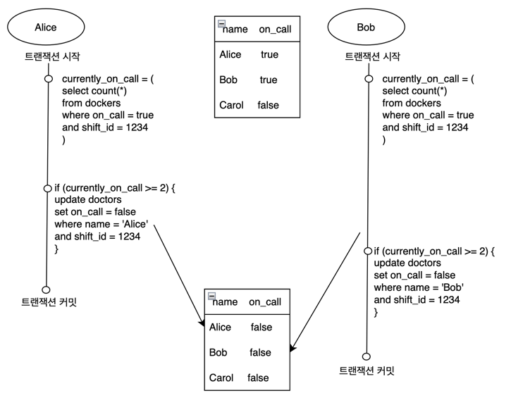
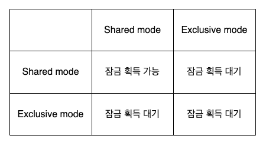

### 쓰기 스큐 (Write Skew)
* 두 트랜잭션이 같은 객체들을 읽어서 그중 일부를 갱신할 때 나타나는 현상이다.

* 병원에는 온콜중인 의사가 최소 한 명 이상이어야 한다는 제약 조건이 있다. (즉, 자신의 온콜을 해제하려면 현재 온콜중인 의사가 둘 이상이어야 한다.)
* 엘리스와 밥은 동시에 트랜잭션을 시작하여 둘 다 현재 온콜중인 의사가 두 명임을 확인한다.
* 엘리스와 밥은 동시에 자신의 온콜 상태를 false로 업데이트한다.
* 두 트랜잭션의 결과로 병원에 온콜중인 의사가 한 명도 남지 않게 된다.

### 쓰기 스큐의 문제
* 여러 객체가 동시에 관련되기 때문에 단일 객체 연산(단일 update query 같은)은 도움이 안된다.
* 스냅숏 격리 수준에서 감지되지 않는다.

### 또 다른 쓰기 스큐의 예
* 회의실 예약 시스템
  * 같은 회의실에 대해서 충돌하는 예약 시간대가 있는지 확인하고, 없다면 회의를 예약하는 경우
  * 아래와 같은 상황에서 스냅숏 격리는 충돌하는 회의가 INSERT되는 것을 막을 수 없다.
```sql
BEGIN TRANSACTION;
SELECT (*)
FROM bookings
WHERE room_id = 123 AND
      end_time > '2023-04-15 12:00:00' AND start_time < '2023-04-15 13:00:00';

-- 위 쿼리가 0을 반환했다면
INSERT INTO bookings (room_id, start_time, end_time, user_id)
VALUES (123, '2023-04-15 12:00:00', '2023-04-15 13:00:00', 1);

COMMIT;
```
* 다중플레이어 게임
  * 잠금은 플레이어들이 두 개의 다른 물체를 게임판 위의 같은 위치로 옮기거나 잠재적으로 게임의 규칙을 위반하는 다른 이동을 막아주지 않는다.

### 쓰기 스큐는 팬텀을 유발할 수 있다.
* 트랜잭션에서 실행한 쓰기가 다른 트랜잭션의 검색 질의 결과를 바꾸는 효과를 팬텀이라고 한다. 위의 두 예시가 그 예시다.
* 스냅숏 격리는 읽기 전용 질의에서는 팬텀을 회피하지만 위의 예시처럼 읽기 쓰기 트랜잭션에서는 팬텀이 쓰기 스큐의 까다로운 경우를 유발할 수 있다.

### 충돌 구체화
* 팬텀의 문제가 잠글 수 있는 객체가 없는 것이었다면 인위적으로 데이터베이스에 잠금 객체를 추가하여 잠글 수 있는 환경을 구성해놓고 문제를 해결할 수도 있다.
* 회의실 예약의 경우, 시간 슬롯에 대한 테이블을 미리 만들어 놓고 해당 슬롯을 잠그는 방식으로 문제를 해결할 수 있다.
  * 시간 슬롯은 예약 정보를 저장하는 데 사용되지는 않고 회의 시간이 충돌하지 않도록 막는 데 사용되는 잠금의 모음일 뿐이다.

### 직렬성
* 동시성 문제를 피하는 가장 간단한 방법은 동시성을 완전히 제거하는 것이다.
  * 한 번에 트랜잭션 하나씩만 직렬로 단일 스레드에서 실행한다.
  * 이게 가능한 이유는 하드웨어의 기술 발전으로 인해 메모리에 데이터셋 전체를 유지할 수 있을만큼 렘이 저렴해졌다.
  * OLTP 트랜잭션은 보통 짧고 실행하는 읽기와 쓰기의 개수가 적다.
  * 오래 실행되는 분석 질의는 읽기 전용이라서 직렬 실행 루프 밖에서 스냅숏 격리를 사용해 일관된 스냅숏을 사용해 실행할 수 있다.

### 파티셔닝
* 여러 CPU 코어와 여러 노드로 확장을 위해 데이터를 파티셔닝하여 각 트랜잭션이 단일 파티션 내에서만 데이터를 읽고 쓰도록 할 수도 있다.
  * CPU 코어에 각자 파티션을 할당해서 트랜잭션 처리량을 CPU 코어 개수에 맞춰 선형적으로 확장 가능
* 여러 파티션에 접근해야 하는 트랜잭션이 있으면 해당 트랜잭션이 접근하는 모든 파티션에 걸쳐서 코디네이션 해야 한다.
  * 추가적인 코디네이션 오버헤드가 있으므로 단일 파티션 트랜잭션보다 느리다.

### 2단계 잠금 (two-phase locking)
* 2 phase commit이랑 다르므로 헷갈리지 않도록 한다.
* 잠금은 shared mode와 exclusive mode로 구현된다.
    * 트랜잭션이 객체를 읽기 원한다면 먼저 공유 모드로 잠금을 획득해야 한다.
        * 동시에 여러 트랜잭션이 공유 모드로 잠금을 획득하는 것은 허용되지만, 그 객체에 이미 독점 모드로 잠금을 획득한 트랜잭션이 있으면 해당 트랜잭션이 완료될 때까지 대기해야 한다.
    * 트랜잭션이 객체에 쓰기를 원한다면 먼저 독점 모드로 잠금을 획득해야 한다.
        * 다른 어떤 트랜잭션도 동시에 잠금을 획득할 수 없으므로(공유 모드든지 독점 모드든지) 그 객체에 잠금이 존재한다면 트랜잭션은 대기해야 한다.
    * 트랜잭션이 객체를 읽다가 쓰기를 실행할 때는 공유 잠금을 독점 잠금으로 업그레이드해야 한다. 업그레이드는 독점 잠금을 직접 획득할 때와 똑같이 동작한다.
    * 트랜잭션이 잠금을 획득한 후에는 트랜잭션이 종료될 때까지 잠금을 갖고 있어야 한다.

* 2PL은 트랜잭션이 빈번하다면 교착 상태를 유발하기 쉽다.
* 데이터베이스에서는 트랜잭션 사이의 교착 상태를 자동으로 감지하고 트랜잭션 중 하나를 어보트시켜서 다른 트랜잭션들이 진행할 수 있게 한다.

### 서술 잠금 (Predicate lock)
```sql
SELECT (*)
FROM bookings
WHERE room_id = 123 AND
    end_time > '2023-04-15 12:00:00' AND start_time < '2023-04-15 13:00:00';
```
* 서술 잠금은 특정 객체에 속하지 않고 위와 같이 검색 조건에 부합하는 모든 객체를 잠근다.
* 모든 형태의 쓰기 스큐와 다른 경쟁 조건을 막을 수 있어서 직렬성 격리가 가능하다.

### 색인 범위 잠금 (index-range locking, next-key locking이라고도 한다.)
* 진행 중인 트랜잭션들이 획득한 잠금이 많으면 조건에 부합하는 잠금을 확인하는 데 시간이 많이 걸리므로 서술 잠금 보다는 색인 범위 잠금을 주로 사용한다.
* 색인 범위 잠금은 서술 잠금을 간략하게 근사한 것이다.
  * 더 많은 객체가 부합하도록 서술 조건을 간략화하는 것은 안전하기 때문이다.
  * 정오와 오후 1시 사이에 123번 방 예약하는 것에 대한 서술 잠금은 모든 시간 범위에 123번 방을 예약하는 것에 대한 잠금으로 근사할 수 있다.
* 색인 범위 잠금은 그 이름에서 알 수 있듯이, 적절한 색인을 필요로 한다.
* 색인 범위 잠금은 서술 잠금보다 정밀하지 않지만(직렬성을 유지하기 위해 반드시 필요한 것보다 큰 범위를 잠글 수도 있다) 오버헤드가 훨씬 더 낮기 떄문에 유용하다.