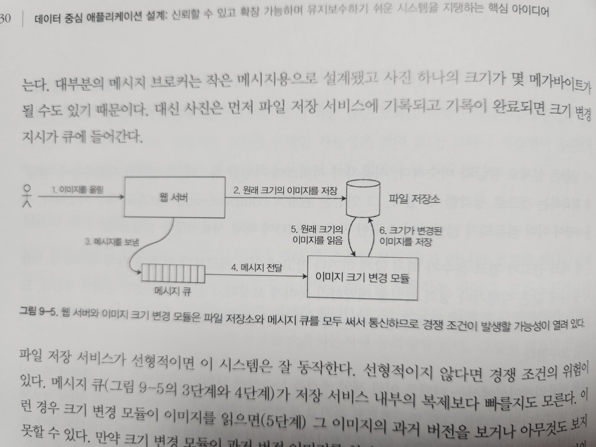

# Chapter 09. 일관성과 합의

## 일관성 보장
* 두 대 이상의 데이터베이스 노드를 바라본다면 두 노드에서 서로 다른 데이터를 볼 가능성이 크다.
  * 다른 노드들에 쓰기 요청이 도착하는 시간이 다르기 때문이다.
  * 이러한 불일치는 데이터베이스가 어떤 복제 방법(단일 리더, 다중 리더, 리더 없는 복제 등)을 쓰느냐에 상관 없이 일어난다.
* 복제 데이터베이스는 대부분 최종적 일관성을 제공한다.
  * 그러나 언제 복제본이 수렴될지에 대해서는 알 수 없다.
  * 이러한 일관성은 약한 보장이다.
  * 강한 보장을 제공하는 시스템은 성능이 나쁘거나 약한 보장을 제공하는 시스템보다 내결함성이 약할지도 모르지만, 올바르게 사용하기 쉬우므로 매력적이다.
* 트랜잭션 격리는 주로 동시에 실행되는 트랜잭션 때문에 발생하는 경쟁 조건을 회피하는 것에 관한 것이지만 분산 일관성은 대개 지연과 결함이 있더라도 복제본의 상태를 코디네이션하는 것에 관한 것이다.

## 선형성
* 선형성은 "데이터베이스가 복제본이 하나만 있다"라는 아이디어를 기반으로 한다.
  * 원자적 일관성(atomic consistency), 강한 일관성(strong consistency), 즉각 일관성(immediate consistency), 외부 일관성(external consistency)라고도 한다.
* 즉, 선형성은 최신성 보장(recency guarantee)이다.

* 위 그림은 비선형성이라서 발생하는 문제를 보여준다.
  * 앨리스와 밥이 동시에 웹 페이지를 새로 불러와서 각자 다른 결과를 받았다면 이상하지 않았을 것이다.
  * 그러나 앨리스가 최종 결과를 외친 후에 밥이 이 결과를 확인하려 들면서 괴리가 발생했다는 것을 인지하게 된다.
* 선형성은 한 클라이언트에서 최초로 값이 변경되었음을 관측했다면 다른 클라이언트에서도 변경된 값을 관측할 수 있어야 한다.

* 선형성의 요구사항은 연산 표시를 모은 선들이 항상 시간순으로 진행돼야 하고 결코 뒤로 가서는 안된다.
  * 이 요구사항은 최신성 보장이 되도록 만들어준다.
* 클라이언트 B의 마지막 읽기는 선형적이지 않다.
  * 다른 요청이 없었다면 B의 읽기는 2여도 괜찮지만, 클라이언트 A가 변경된 4라는 값을 관측했기 때문에 B의 읽기는 4여야 한다. (과거의 값을 읽는 것은 허용되지 않기 때문)

### 선형성과 직렬성
* 직렬성
  * 직렬성은 모든 트랜잭션이 여러 객체를 읽고 쓸 수 있는 상황에서의 트랜잭션들의 격리 속성이다.
  * 직렬성은 트랜잭션들이 어떤 순서에 따라 실행되는 것처럼 동작하도록 보장해준다. 그 순서가 트랜잭션들이 실제로 실행되는 순서와 달라도 상관없다.
* 선형성
  * 레지스터(개별 객체)에 실행되는 읽기와 쓰기에 대한 최신성 보장이다.
  * 선형성은 연산을 트랜잭션으로 묶지 않아서 충돌 구체화 같은 부가적인 수단을 사용하지 않으면 쓰기 스큐 같은 문제를 막지 못한다.

## 선형성을 위한 요구사항
### 잠금과 리더 선출
* 단일 리더 복제를 사용하는 시스템은 리더가 하나만 존재하도록 보장해야 한다.
* 리더를 선출하는 한 가지 방법은 잠금을 사용하는 것이다.
  * 모든 노드가 시작할 때 잠금을 시도하고 성공한 노드가 리더가 된다.
  * 이 잠금은 선형적이어야 한다.
* 분산 잠금과 리더 선출을 구현하기 위해 아파치 주키퍼나 etcd 같은 코디네이션 서비스가 종종 사용된다.
  * 이들은 합의 알고리즘을 사용해 선형성 연산을 내결함성이 있는 방식으로 구현한다.

### 채널 간 타이밍 의존성

* 선형성 위반은 시스템에 부가적인 통신 채널이 있을 때 발견될 수 있다.
* 위의 그림에서 3, 4단계의 메시지 큐가 저장 서비스 내부의 복제가 빠를 수도 있기 때문에 선형성이 위반되는 상황이 발생할 수 있다.

### 선형성 시스템 구현하기
* 선형성은 근본적으로 "데이터 복사본이 하나만 있는 것처럼 동작하고 그 데이터에 실행되는 모든 연산은 원자적"이라는 것을 의미하므로 가장 간단한 해답은 정말로 데이터 복제본을 하나만 사용하는 것이다.
* 그러나 이 방법은 성능과 내결함성 측면에서 좋지 않다.
* 시스템이 내결함성을 지니도록 만드는 가장 흔한 방법은 복제를 사용하는 것이다.

### 복제 방법에 따른 선형성 가능 여부
* 단일 리더 복제 (선형적이 될 가능성이 있음)
  * 리더나 동기식으로 갱신된 팔로워에서 실행한 읽기는 선형적이 될 가능성이 있다.
  * 모든 단일 리더 데이터베이스가 실제로 선형적인 것은 아니다. (설계 때문일 수도 있고(예를 들어 스냅숏 격리를 사용하기 때문에) 동시성 버그 때문일 수도 있다.)
  * 비동기 복제를 사용하면 장애 복구를 할 때 커밋된 쓰기가 손실될 수도 있는데 지속성과 선형성을 모두 위반하는 것이다.
* 합의 알고리즘 (선형적)
  * 합의 프로토콜에는 스플릿 브레인과 복제본이 뒤처지는 문제를 막을 수단이 포함된다.
  * 예를 들어 주키퍼와 etcd가 있다.
* 다중 리더 복제 (비선형적)
  * 다중 리더 복제를 하는 시스템들은 일반적으로 선형적이지 않다.
  * 여러 노드에서 동시에 쓰기를 처리하고 그렇게 쓰여진 내용을 비동기로 다른 노드에 복제하기 때문이다.
* 리더 없는 복제 (아마도 비선형적)
  * 정족수 읽기와 쓰기를 요구함으로써 엄격한 일관성을 달성할 수 있을 것처럼 보이지만, 정족수의 정확한 설정에 따라, 그리고 엄격한 일관성을 어떻게 정의하느냐에 따라 비선형적이게 된다.
  * 일 기준 시계를 기반으로한 "최종 쓰기 승리" 충돌 해소 방법은 비선형적이다. 시계 타임스탬프는 시계 스큐 때문에 이벤트의 실제 순서와 일치하리라고 보장할 수 없기 때문이다.
  * 느슨한 정족수도 선형성의 가능성을 망친다. 엄격한 정족수를 사용해도 비선형적으로 동작할 가능성이 있다.

### CAP 정리
* 일관성(Consistency), 가용성(Availability), 분단 내성(Partition tolerance) 세 가지 특성 중 두 가지만 선택할 수 있는 것으로 표현되어 오해가 많이 발생한다.
* 네트워크 분단은 일종의 결함이므로 선택할 수 있는 뭔가가 아니다. 네트워크 분단은 좋은 싫든 발생한다.
* 네트워크가 올바르게 동작할 때는 시스템이 일관성과 완전한 가용성 모두를 제공할 수 있지만, 네트워크 결함이 생기면 선형성과 완전한 가용성 사이에서 선택해야 한다.
* 따라서 CAP는 네트워크 분단이 생겼을 때 일관성과 가용성 중 하나를 선택하라는 의미로 보는 것이 좋다.

## 순서화 보장
* 선형성은 데이터 복사본이 하나만 있는 것처럼 동작하고 모든 연산이 원자적으로 효과가 나타나는 것처럼 보이는 것이라고 정리했다.
* 선형성의 정의는 연산들이 잘 정의된 순서대로 실행한다는 것을 암시하며, 순서화는 선형성의 근본적인 아이디어다.

### 순서화와 인과성
* 순서화는 인과성을 보존하는데 도움을 준다.
* 인과성은 이벤트에 순서를 부과한다. 결과가 나타나기 전에 원인이 발생한다.
* 시스템이 인과성에 의해 부과된 순서를 지키면 그 시스템은 인과적으로 일관적(causally consistent)이라고 한다.

### 인과적 순서가 전체 순서는 아니다
* 전체 순서는 어떤 두 요소를 비교할 수 있게 하므로 두 요소가 있으면 항상 크고 작은 것을 비교할 수 있다.
* 하지만 비교가 불가하여 부분적으로만 순서가 정해지는 경우도 있다.
* 전체 순서와 부분 순서의 차이점은 다른 데이터베이스 일관성 모델에 반영된다.
* 선형성
  * 선형성 시스템에서는 연산의 전체 순서를 정할 수 있다.
  * 시스템이 데이터 복사본이 하나만 있는 것처럼 동작하고 모든 연산이 원자적이면 어떤 두 연산에 대해 항상 둘 중 하나가 먼저 실행됐다고 말할 수 있다는 뜻이다.
* 인과성
  * 두 이벤트에 인과적인 관계가 있으면 이들은 순서가 있지만 이들이 동시에 실행되면 비교할 수 없다.
  * 인과성이 전체 순서가 아닌 부분 순서를 정의한다는 뜻이다.

### 선형성은 인과적 일관성보다 강하다
* 선형성은 인과성을 내포한다. 어떤 시스템이든지 선형적이라면 인과성도 올바르게 유지한다.
